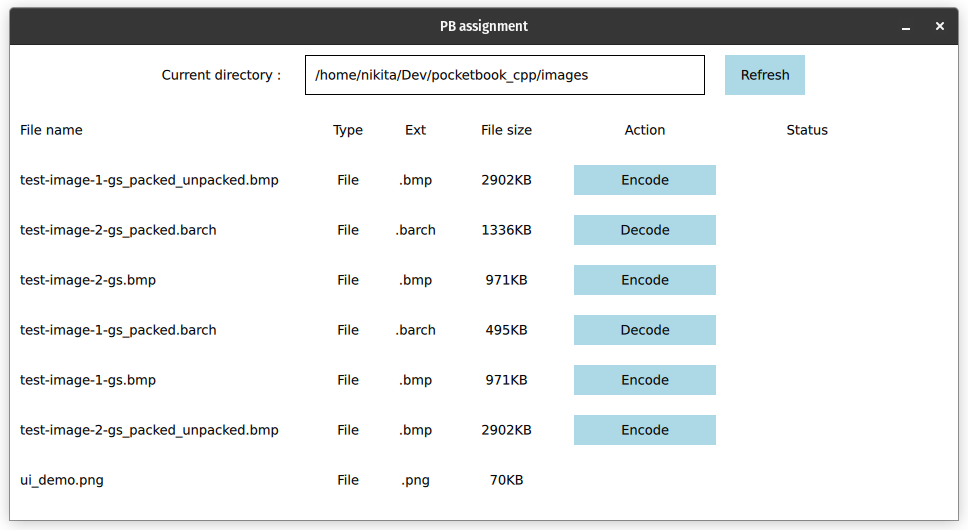

# Pocketbook cpp test task

## Compressing & decompressing bitmaps, simple ui

---

## Installing
```
git clone --recursive <this rep>
```

## Running
On Unix, assuming everything (build essentials, qt) is installed:
1. Set QT_CMAKE_IMPORTS to path to your qt headers
2. Run 
```
bash run.sh
```
   
On windows it won't run due to dependencies on X11 for CImg

## UI
